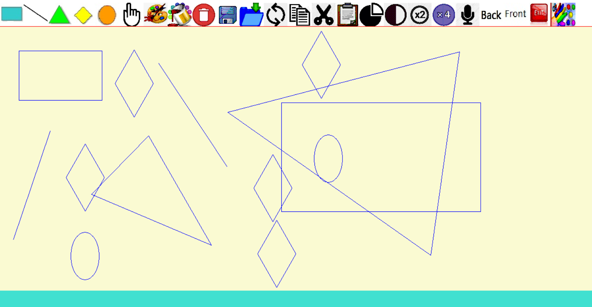
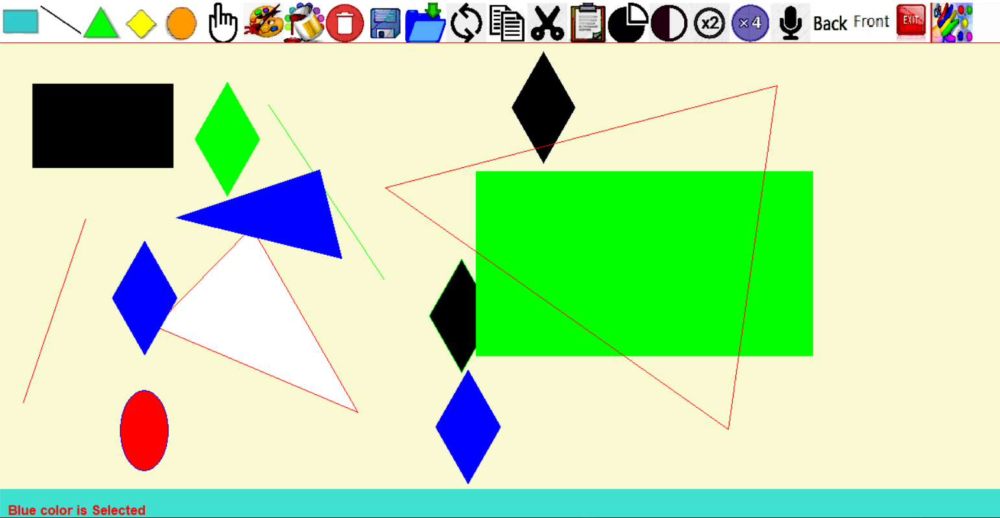
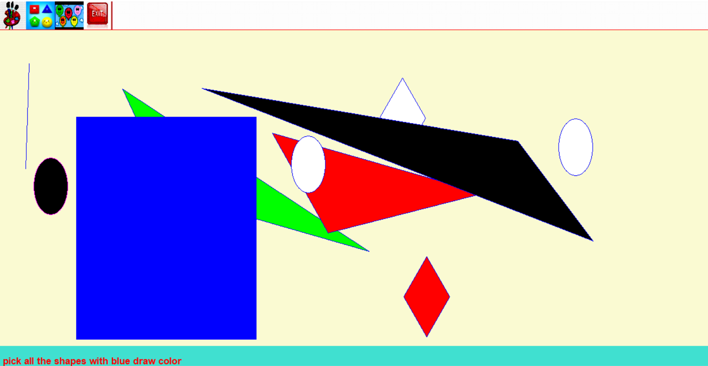

# Paint-For-Kids

Paint for kids is a game for children, that aims to teach children how to draw some shapes like rectangle, triangle , line , rhombus and ellipse, also these shapes can be colored by choosing one of the coloring icons, color borders only or color the whole shape.

Our game supports two modes, drawing mode and playing mode, first the drawing mode which contains lots of icons that do several actions like the select icon to select a certain shape and perform specific action on it, coloring icons to give colors to shapes after drawing, delete icon, copy or cut and paste the shape where ever you want in the screen by selecting the shape then choose copy or cut icon then paste icon and click on the position where you want to place the shape, resize icons , voice icon to teach children how to spell the name of the shapes supported by the game, then back and front icon to replace shapes above or below each other by selecting the shape then click front or back and it will be in the top of all shapes drawn or below them, also after finishing you can save your work in a file, you can save the whole graph or save by shape type and also you can open file saved before.

Switching to the playing mode where you can play with your graphs created before, there are two types of playing, first picking shapes by color, you are asked to pick shapes with certain color and the game will count the number of wrong and correct choices you get, the second type is picking shapes according to their type as you are asked to pick a certain type of shapes and the game again will count your correct and wrong choices.   

